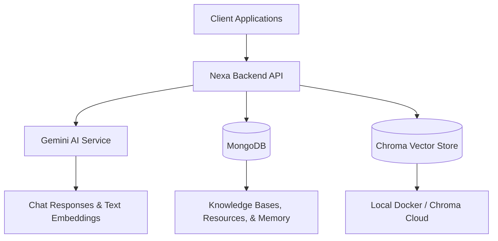

# Nexa RAG Pipeline

A production-ready Retrieval-Augmented Generation (RAG) backend built with **Gemini**, **MongoDB**, and **Chroma**.

## 🚀 Features

- **Gemini Integration**: High-performance embeddings and conversational AI using Google Gemini.
- **Dual-Environment Vector Search**: Seamlessly toggle between local development (Docker Chroma) and production (Chroma Cloud `NexaDB`).
- **Persistent Storage**: MongoDB for tracking Knowledge Bases, Document Resources, and Conversation Memory.
- **Robust Ingestion Pipeline**: Built-in document parsing (PDF, Text), semantic chunking, and intelligent metadata extraction.
- **Knowledge Base API**: Full RESTful management of custom knowledge bases with automatic vector lifecycle cleanup via background workers.
- **Conversation Memory**: Context-aware chat sessions persisted securely in MongoDB.
- **Test Coverage**: Comprehensive Jest test suite covering all APIs, Stores, and AI integrations.

## 📋 Prerequisites

- Node.js 24+
- Docker & Docker Compose (for local development)
- MongoDB (local or Atlas)
- Gemini API Key
- Chroma Cloud API Key (for production)

## 🛠️ Quick Start

### 1. Install Dependencies
```bash
cd backend
npm install
```

### 2. Environment Configuration
Copy `.env.example` to `.env.local` and fill in your secrets:
```env
# AI Services
GEMINI_API_KEY=your_gemini_api_key

# Database configuration
MONGO_URI=mongodb://localhost:27017/rag-pipeline

# Vector Store (local or cloud)
CHROMA_ENV=local 
CHROMA_CLOUD_API_KEY=your_chroma_api_key
```

### 3. Start Local Infrastructure
Start your local Chroma and MongoDB containers:
```bash
cd backend
docker compose up -d
```

### 4. Run the Server
```bash
cd backend
npm run dev
```

## 🧰 Development Commands

- `npm test` — Run the full Jest test suite.
- `npm run dev` — Start the backend with hot-reload.
- `docker compose ps` — Check the status of your local infrastructure.
- `node scripts/migrate-to-cloud.js` — Migrate your local Chroma vector data directly to Chroma Cloud.

## 🏗️ Architecture


